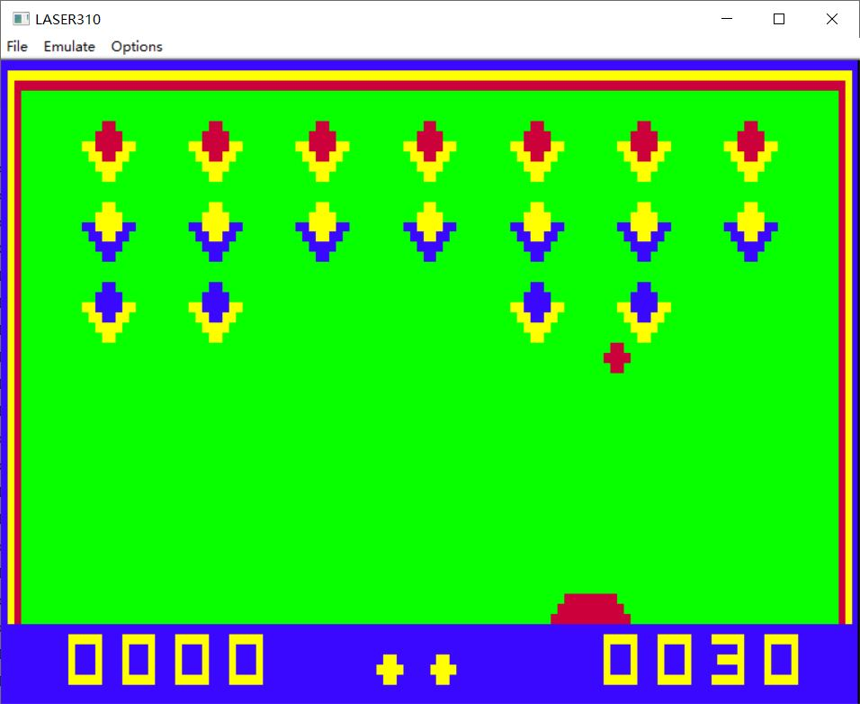
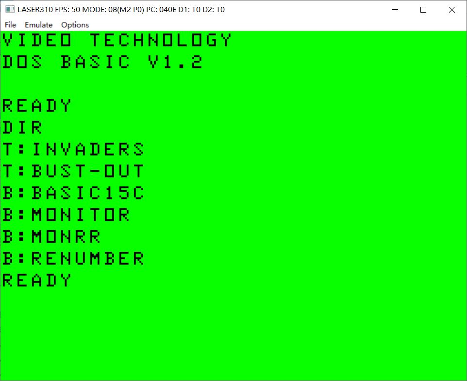
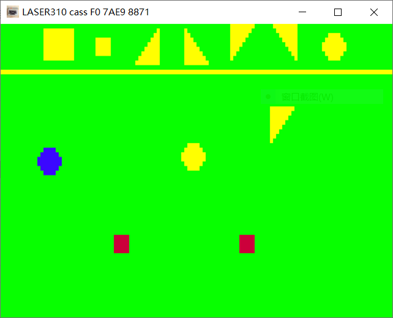
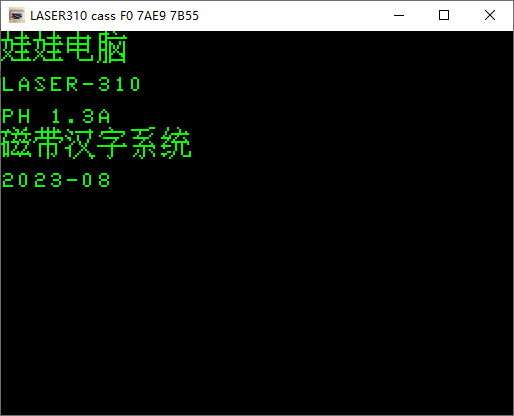

# LASER310EMU

## Build instructions

### MINGW
* Download and install msys2-x86_64-20220503.exe from https://www.msys2.org/
* Start MingW64 environment from c:\msys64
* Install following packes using pacman
~~~
pacman -S mingw-w64-x86_64-gcc
pacman -S mingw-w64-x86_64-SDL2 mingw-w64-x86_64-SDL2_mixer
pacman -S make
~~~ 
* Change directory to LASER310EMU/src.
~~~
cd /c/LASER310EMU/src
make
cd ..
./LASER310EMU
~~~
* To clean the build : make clean

### ESP32
* PlatformIO: Build
* PlatformIO: Build Filesystem Image
* PlatformIO: Upload Filesystem Image

## LASER310 Emulator

键盘按键

键盘操作
ESC       : Ctrl + -
Backspace : Ctrl + M

键盘模拟游戏杆

键盘       JOYSTICK 1
上下左右 : 上下左右
TAB      : Fire
`        : Arm

快捷键盘操作
F1        键盘输入RUN
F11       全屏切换
鼠标右键  剪切板的内容自动输入到模拟器

## LASER310SDL Emulator

把 vz 文件拖拽到模拟器窗口，模拟磁带载入。

## LASER310 PH 1.3A

来自《微电脑剖析及功能改进》彭辛岷1993年一书的BASIC磁带扩充系统，支持中文显示。

