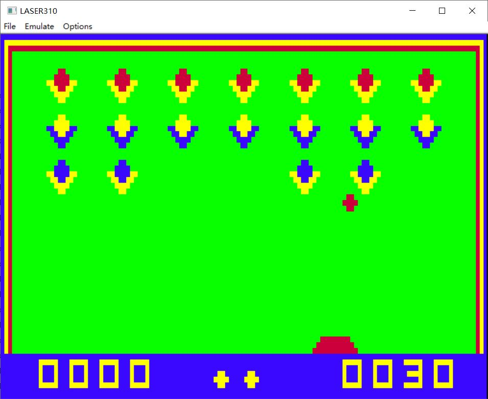
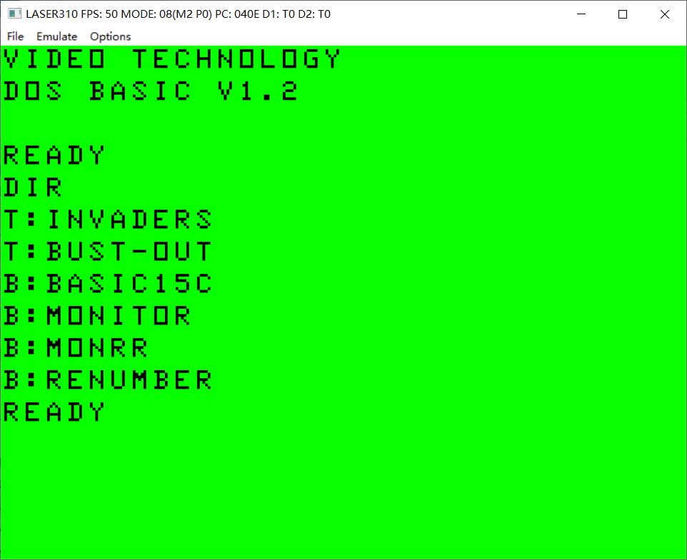

# LASER310EMU
LASER310 Emulator

键盘按键

键盘操作
ESC       : Ctrl + -
Backspace : Ctrl + M

键盘模拟游戏杆

键盘       JOYSTICK 1
上下左右 : 上下左右
TAB      : Fire
`        : Arm

快捷键盘操作
F1        键盘输入RUN
F11       全屏切换
鼠标右键  剪切板的内容自动输入到模拟器

# Build environment
To build LASER310EMU, you need to download mingw-17.1. It includes x64-native build of GCC 9.2.0 and SDL 2.0.10.
[MinGW Distro - nuwen.net](https://nuwen.net/mingw.html)